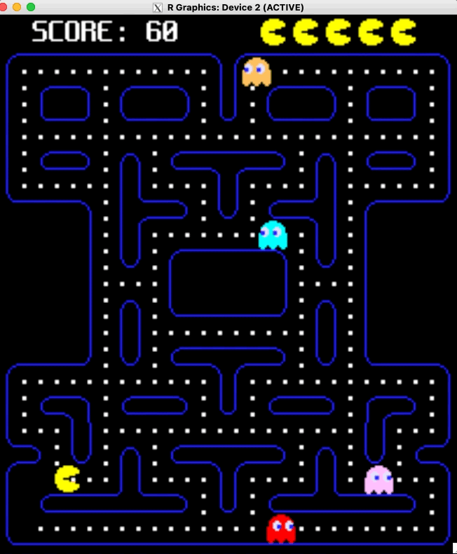

# Pacman-style game in R

This is the full code for a pacman-style game in R.

The game plays in realtime using 2 key packages:

* [`{nara`}`](https://github.com/coolbutuseless/nara) for manipulation of
  *nativeRaster* images as a fast in-memory drawing canvas
* [`{eventloop}`](https://github.com/coolbutuseless/eventloop) for event-driven
  interaction - allowing for keyboard feedback while rendering the game with
  sound.
  
## Gameplay  
  

  
## Controls

* Run game with `source('game.R')`
* Control pacman with arrow keys (or WASD)
  
  
## Limitation - WindowsOS

WindowsOS does not currently have support for the `onIdle` callback and 
therefore does not support  event-driven interactive graphics as implemented 
in the `{eventloop}` package.

**If you are a windows developor capable of adding support for an `onIdle` callback
to R itself, please get in touch!**

## Limitation - Flickering Cursor

`{eventloop}` makes use of the `x11()` graphics device with a double-buffered
backend based on Cairo  (`x11(type = 'dbcairo')`).

The double-buffering within the graphics device is coordinated through use
of `dev.hold()` and `dev.flush()` calls.

Whenever `dev.hold()` is called, the cursor will be set to the busy cursor
(usually a stopwatch on macOS), and when `dev.flush()` is called the 
cursor reverts to a normal pointer arrow.

Since `dev.hold()` and `dev.flush()` are called when drawing every single 
frame, the cursor will flicker between these two images.

The interim solution is to not have the cursor over the window when interacting
with the app.  This only really works when the app solely relies on keyboard
feedback (like this pacman game).

The more complicated solution will involve crafting a patch to R itself to
make the cursor change behaviour user-configurable rather than hard-coded.

**If you are are an R developer capable of crafting such a patch to R ,
please get in touch with me!**
